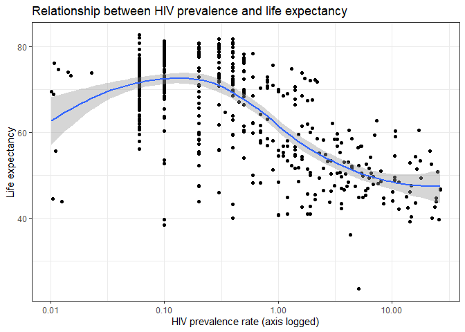
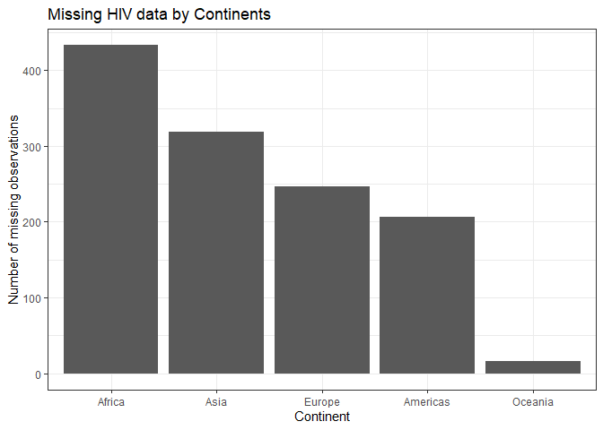

Joining Gapminder Data
================
Kejing Li

# Get the original data

``` r
library(tidyverse)
```

    ## -- Attaching packages -------------------------------------------------------------------- tidyverse 1.2.1 --

    ## v ggplot2 3.2.1     v purrr   0.3.2
    ## v tibble  2.1.3     v dplyr   0.8.3
    ## v tidyr   1.0.0     v stringr 1.4.0
    ## v readr   1.3.1     v forcats 0.4.0

    ## -- Conflicts ----------------------------------------------------------------------- tidyverse_conflicts() --
    ## x dplyr::filter() masks stats::filter()
    ## x dplyr::lag()    masks stats::lag()

``` r
library(gapminder)

gapminder
```

    ## # A tibble: 1,704 x 6
    ##    country     continent  year lifeExp      pop gdpPercap
    ##    <fct>       <fct>     <int>   <dbl>    <int>     <dbl>
    ##  1 Afghanistan Asia       1952    28.8  8425333      779.
    ##  2 Afghanistan Asia       1957    30.3  9240934      821.
    ##  3 Afghanistan Asia       1962    32.0 10267083      853.
    ##  4 Afghanistan Asia       1967    34.0 11537966      836.
    ##  5 Afghanistan Asia       1972    36.1 13079460      740.
    ##  6 Afghanistan Asia       1977    38.4 14880372      786.
    ##  7 Afghanistan Asia       1982    39.9 12881816      978.
    ##  8 Afghanistan Asia       1987    40.8 13867957      852.
    ##  9 Afghanistan Asia       1992    41.7 16317921      649.
    ## 10 Afghanistan Asia       1997    41.8 22227415      635.
    ## # ... with 1,694 more rows

``` r
#set theme for the report
theme_set(theme_bw())
```

# Import the HIV data

``` r
hiv <- read_csv("data/gapminder_hiv.csv")
```

    ## Parsed with column specification:
    ## cols(
    ##   country = col_character(),
    ##   year = col_double(),
    ##   hivRate = col_double()
    ## )

``` r
hiv
```

    ## # A tibble: 3,301 x 3
    ##    country                   year hivRate
    ##    <chr>                    <dbl>   <dbl>
    ##  1 Angola                    1979  0.0265
    ##  2 Argentina                 1979  0.0205
    ##  3 Bahamas                   1979  0.01  
    ##  4 Barbados                  1979  0.0277
    ##  5 Botswana                  1979  0.106 
    ##  6 Brazil                    1979  0.0945
    ##  7 Burkina Faso              1979  0.01  
    ##  8 Burundi                   1979  0.0159
    ##  9 Canada                    1979  0.0130
    ## 10 Central African Republic  1979  0.113 
    ## # ... with 3,291 more rows

# What is the relationship between HIV prevalence and life expectancy?

``` r
#use inner join because missing value would not be plotted by ggplot
inner_join(gapminder, hiv) %>%
  ggplot(aes(hivRate, lifeExp))+
#it's easier to see the relationship if we log-transform hivRate
  scale_x_log10()+
  geom_point()+
  geom_smooth()+
  labs(title = "Relationship between HIV prevalence and life expectancy",
      x = "HIV prevalence rate (axis logged)",
      y = "Life expectancy")
```

    ## Joining, by = c("country", "year")

    ## Warning: Column `country` joining factor and character vector, coercing
    ## into character vector

    ## `geom_smooth()` using method = 'loess' and formula 'y ~ x'

<!-- -->

**Answer:** As shown in the graph, Life expectancy and HIV prevalence
rate is negatively related.

# Which continents have the most observations with missing HIV data?

``` r
#use left join to keep all observations in gapminder
left_join(gapminder, hiv) %>%
#filter out the missing hivRate and count by continents
  filter(is.na(hivRate)) %>%
  count(continent) %>%
#reorder the obeservations by its value
  ggplot(aes(fct_reorder(continent, -n), n))+
  geom_col()+
  labs(title = "Missing HIV data by Continents",
         x = "Continent",
         y = "Number of missing observations")
```

    ## Joining, by = c("country", "year")

    ## Warning: Column `country` joining factor and character vector, coercing
    ## into character vector

<!-- -->

**Answer:** Africa has the most observations with missing HIV, followed
by Asia.

## Session info

``` r
devtools::session_info()
```

    ## - Session info ----------------------------------------------------------
    ##  setting  value                       
    ##  version  R version 3.6.1 (2019-07-05)
    ##  os       Windows 10 x64              
    ##  system   x86_64, mingw32             
    ##  ui       RTerm                       
    ##  language (EN)                        
    ##  collate  English_United States.1252  
    ##  ctype    English_United States.1252  
    ##  tz       America/Chicago             
    ##  date     2019-10-20                  
    ## 
    ## - Packages --------------------------------------------------------------
    ##  package     * version date       lib source        
    ##  assertthat    0.2.1   2019-03-21 [1] CRAN (R 3.6.1)
    ##  backports     1.1.5   2019-10-02 [1] CRAN (R 3.6.1)
    ##  broom         0.5.2   2019-04-07 [1] CRAN (R 3.6.1)
    ##  callr         3.3.2   2019-09-22 [1] CRAN (R 3.6.1)
    ##  cellranger    1.1.0   2016-07-27 [1] CRAN (R 3.6.1)
    ##  cli           1.1.0   2019-03-19 [1] CRAN (R 3.6.1)
    ##  colorspace    1.4-1   2019-03-18 [1] CRAN (R 3.6.1)
    ##  crayon        1.3.4   2017-09-16 [1] CRAN (R 3.6.1)
    ##  desc          1.2.0   2018-05-01 [1] CRAN (R 3.6.1)
    ##  devtools      2.2.1   2019-09-24 [1] CRAN (R 3.6.1)
    ##  digest        0.6.21  2019-09-20 [1] CRAN (R 3.6.1)
    ##  dplyr       * 0.8.3   2019-07-04 [1] CRAN (R 3.6.1)
    ##  ellipsis      0.3.0   2019-09-20 [1] CRAN (R 3.6.1)
    ##  evaluate      0.14    2019-05-28 [1] CRAN (R 3.6.1)
    ##  fansi         0.4.0   2018-10-05 [1] CRAN (R 3.6.1)
    ##  forcats     * 0.4.0   2019-02-17 [1] CRAN (R 3.6.1)
    ##  fs            1.3.1   2019-05-06 [1] CRAN (R 3.6.1)
    ##  gapminder   * 0.3.0   2017-10-31 [1] CRAN (R 3.6.1)
    ##  generics      0.0.2   2018-11-29 [1] CRAN (R 3.6.1)
    ##  ggplot2     * 3.2.1   2019-08-10 [1] CRAN (R 3.6.1)
    ##  glue          1.3.1   2019-03-12 [1] CRAN (R 3.6.1)
    ##  gtable        0.3.0   2019-03-25 [1] CRAN (R 3.6.1)
    ##  haven         2.1.1   2019-07-04 [1] CRAN (R 3.6.1)
    ##  hms           0.5.1   2019-08-23 [1] CRAN (R 3.6.1)
    ##  htmltools     0.3.6   2017-04-28 [1] CRAN (R 3.6.1)
    ##  httr          1.4.1   2019-08-05 [1] CRAN (R 3.6.1)
    ##  jsonlite      1.6     2018-12-07 [1] CRAN (R 3.6.1)
    ##  knitr         1.25    2019-09-18 [1] CRAN (R 3.6.1)
    ##  labeling      0.3     2014-08-23 [1] CRAN (R 3.6.0)
    ##  lattice       0.20-38 2018-11-04 [1] CRAN (R 3.6.1)
    ##  lazyeval      0.2.2   2019-03-15 [1] CRAN (R 3.6.1)
    ##  lifecycle     0.1.0   2019-08-01 [1] CRAN (R 3.6.1)
    ##  lubridate     1.7.4   2018-04-11 [1] CRAN (R 3.6.1)
    ##  magrittr      1.5     2014-11-22 [1] CRAN (R 3.6.1)
    ##  memoise       1.1.0   2017-04-21 [1] CRAN (R 3.6.1)
    ##  modelr        0.1.5   2019-08-08 [1] CRAN (R 3.6.1)
    ##  munsell       0.5.0   2018-06-12 [1] CRAN (R 3.6.1)
    ##  nlme          3.1-140 2019-05-12 [1] CRAN (R 3.6.1)
    ##  pillar        1.4.2   2019-06-29 [1] CRAN (R 3.6.1)
    ##  pkgbuild      1.0.5   2019-08-26 [1] CRAN (R 3.6.1)
    ##  pkgconfig     2.0.3   2019-09-22 [1] CRAN (R 3.6.1)
    ##  pkgload       1.0.2   2018-10-29 [1] CRAN (R 3.6.1)
    ##  prettyunits   1.0.2   2015-07-13 [1] CRAN (R 3.6.1)
    ##  processx      3.4.1   2019-07-18 [1] CRAN (R 3.6.1)
    ##  ps            1.3.0   2018-12-21 [1] CRAN (R 3.6.1)
    ##  purrr       * 0.3.2   2019-03-15 [1] CRAN (R 3.6.1)
    ##  R6            2.4.0   2019-02-14 [1] CRAN (R 3.6.1)
    ##  Rcpp          1.0.2   2019-07-25 [1] CRAN (R 3.6.1)
    ##  readr       * 1.3.1   2018-12-21 [1] CRAN (R 3.6.1)
    ##  readxl        1.3.1   2019-03-13 [1] CRAN (R 3.6.1)
    ##  remotes       2.1.0   2019-06-24 [1] CRAN (R 3.6.1)
    ##  rlang         0.4.0   2019-06-25 [1] CRAN (R 3.6.1)
    ##  rmarkdown     1.16    2019-10-01 [1] CRAN (R 3.6.1)
    ##  rprojroot     1.3-2   2018-01-03 [1] CRAN (R 3.6.1)
    ##  rstudioapi    0.10    2019-03-19 [1] CRAN (R 3.6.1)
    ##  rvest         0.3.4   2019-05-15 [1] CRAN (R 3.6.1)
    ##  scales        1.0.0   2018-08-09 [1] CRAN (R 3.6.1)
    ##  sessioninfo   1.1.1   2018-11-05 [1] CRAN (R 3.6.1)
    ##  stringi       1.4.3   2019-03-12 [1] CRAN (R 3.6.0)
    ##  stringr     * 1.4.0   2019-02-10 [1] CRAN (R 3.6.1)
    ##  testthat      2.2.1   2019-07-25 [1] CRAN (R 3.6.1)
    ##  tibble      * 2.1.3   2019-06-06 [1] CRAN (R 3.6.1)
    ##  tidyr       * 1.0.0   2019-09-11 [1] CRAN (R 3.6.1)
    ##  tidyselect    0.2.5   2018-10-11 [1] CRAN (R 3.6.1)
    ##  tidyverse   * 1.2.1   2017-11-14 [1] CRAN (R 3.6.1)
    ##  usethis       1.5.1   2019-07-04 [1] CRAN (R 3.6.1)
    ##  utf8          1.1.4   2018-05-24 [1] CRAN (R 3.6.1)
    ##  vctrs         0.2.0   2019-07-05 [1] CRAN (R 3.6.1)
    ##  withr         2.1.2   2018-03-15 [1] CRAN (R 3.6.1)
    ##  xfun          0.10    2019-10-01 [1] CRAN (R 3.6.1)
    ##  xml2          1.2.2   2019-08-09 [1] CRAN (R 3.6.1)
    ##  yaml          2.2.0   2018-07-25 [1] CRAN (R 3.6.0)
    ##  zeallot       0.1.0   2018-01-28 [1] CRAN (R 3.6.1)
    ## 
    ## [1] D:/Tools/R-3.6.1/library
