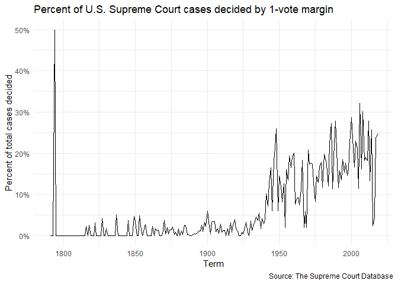

Exploring U.S. Supreme Court Decisions
================
Kejing Li

## Get the data

``` r
# load useful packages
library(tidyverse)
```

    ## -- Attaching packages --------------------------------------- tidyverse 1.2.1 --

    ## v ggplot2 3.2.1     v purrr   0.3.2
    ## v tibble  2.1.3     v dplyr   0.8.3
    ## v tidyr   1.0.0     v stringr 1.4.0
    ## v readr   1.3.1     v forcats 0.4.0

    ## -- Conflicts ------------------------------------------ tidyverse_conflicts() --
    ## x dplyr::filter() masks stats::filter()
    ## x dplyr::lag()    masks stats::lag()

``` r
# load data
scdbv_mod <- read_csv("data/SCDB_2019_01_justiceCentered_Citation.csv")
```

    ## Parsed with column specification:
    ## cols(
    ##   .default = col_double(),
    ##   caseId = col_character(),
    ##   docketId = col_character(),
    ##   caseIssuesId = col_character(),
    ##   voteId = col_character(),
    ##   dateDecision = col_character(),
    ##   usCite = col_character(),
    ##   sctCite = col_character(),
    ##   ledCite = col_character(),
    ##   lexisCite = col_character(),
    ##   chief = col_character(),
    ##   caseName = col_character(),
    ##   dateArgument = col_character(),
    ##   dateRearg = col_character(),
    ##   lawMinor = col_character(),
    ##   justiceName = col_character()
    ## )

    ## See spec(...) for full column specifications.

    ## Warning: 52201 parsing failures.
    ##  row    col               expected actual                                             file
    ## 1225 docket no trailing characters      M 'data/SCDB_2019_01_justiceCentered_Citation.csv'
    ## 1226 docket no trailing characters      M 'data/SCDB_2019_01_justiceCentered_Citation.csv'
    ## 1227 docket no trailing characters      M 'data/SCDB_2019_01_justiceCentered_Citation.csv'
    ## 1228 docket no trailing characters      M 'data/SCDB_2019_01_justiceCentered_Citation.csv'
    ## 1229 docket no trailing characters      M 'data/SCDB_2019_01_justiceCentered_Citation.csv'
    ## .... ...... ...................... ...... ................................................
    ## See problems(...) for more details.

``` r
scdbv_leg <- read_csv("data/SCDB_Legacy_05_justiceCentered_Citation.csv")
```

    ## Parsed with column specification:
    ## cols(
    ##   .default = col_double(),
    ##   caseId = col_character(),
    ##   docketId = col_character(),
    ##   caseIssuesId = col_character(),
    ##   voteId = col_character(),
    ##   dateDecision = col_character(),
    ##   usCite = col_character(),
    ##   sctCite = col_logical(),
    ##   ledCite = col_character(),
    ##   lexisCite = col_character(),
    ##   chief = col_character(),
    ##   docket = col_logical(),
    ##   caseName = col_character(),
    ##   dateArgument = col_character(),
    ##   dateRearg = col_character(),
    ##   adminAction = col_logical(),
    ##   adminActionState = col_logical(),
    ##   lawMinor = col_character(),
    ##   justiceName = col_character()
    ## )
    ## See spec(...) for full column specifications.

    ## Warning: 308308 parsing failures.
    ##  row         col           expected actual                                               file
    ## 3145 adminAction 1/0/T/F/TRUE/FALSE     21 'data/SCDB_Legacy_05_justiceCentered_Citation.csv'
    ## 3146 adminAction 1/0/T/F/TRUE/FALSE     21 'data/SCDB_Legacy_05_justiceCentered_Citation.csv'
    ## 3147 adminAction 1/0/T/F/TRUE/FALSE     21 'data/SCDB_Legacy_05_justiceCentered_Citation.csv'
    ## 3148 adminAction 1/0/T/F/TRUE/FALSE     21 'data/SCDB_Legacy_05_justiceCentered_Citation.csv'
    ## 3149 adminAction 1/0/T/F/TRUE/FALSE     21 'data/SCDB_Legacy_05_justiceCentered_Citation.csv'
    ## .... ........... .................. ...... ..................................................
    ## See problems(...) for more details.

``` r
scdbv_mod
```

    ## # A tibble: 80,269 x 61
    ##    caseId docketId caseIssuesId voteId dateDecision decisionType usCite
    ##    <chr>  <chr>    <chr>        <chr>  <chr>               <dbl> <chr> 
    ##  1 1946-~ 1946-00~ 1946-001-01~ 1946-~ 11/18/1946              1 329 U~
    ##  2 1946-~ 1946-00~ 1946-001-01~ 1946-~ 11/18/1946              1 329 U~
    ##  3 1946-~ 1946-00~ 1946-001-01~ 1946-~ 11/18/1946              1 329 U~
    ##  4 1946-~ 1946-00~ 1946-001-01~ 1946-~ 11/18/1946              1 329 U~
    ##  5 1946-~ 1946-00~ 1946-001-01~ 1946-~ 11/18/1946              1 329 U~
    ##  6 1946-~ 1946-00~ 1946-001-01~ 1946-~ 11/18/1946              1 329 U~
    ##  7 1946-~ 1946-00~ 1946-001-01~ 1946-~ 11/18/1946              1 329 U~
    ##  8 1946-~ 1946-00~ 1946-001-01~ 1946-~ 11/18/1946              1 329 U~
    ##  9 1946-~ 1946-00~ 1946-001-01~ 1946-~ 11/18/1946              1 329 U~
    ## 10 1946-~ 1946-00~ 1946-002-01~ 1946-~ 11/18/1946              1 329 U~
    ## # ... with 80,259 more rows, and 54 more variables: sctCite <chr>,
    ## #   ledCite <chr>, lexisCite <chr>, term <dbl>, naturalCourt <dbl>,
    ## #   chief <chr>, docket <dbl>, caseName <chr>, dateArgument <chr>,
    ## #   dateRearg <chr>, petitioner <dbl>, petitionerState <dbl>,
    ## #   respondent <dbl>, respondentState <dbl>, jurisdiction <dbl>,
    ## #   adminAction <dbl>, adminActionState <dbl>, threeJudgeFdc <dbl>,
    ## #   caseOrigin <dbl>, caseOriginState <dbl>, caseSource <dbl>,
    ## #   caseSourceState <dbl>, lcDisagreement <dbl>, certReason <dbl>,
    ## #   lcDisposition <dbl>, lcDispositionDirection <dbl>,
    ## #   declarationUncon <dbl>, caseDisposition <dbl>,
    ## #   caseDispositionUnusual <dbl>, partyWinning <dbl>,
    ## #   precedentAlteration <dbl>, voteUnclear <dbl>, issue <dbl>,
    ## #   issueArea <dbl>, decisionDirection <dbl>,
    ## #   decisionDirectionDissent <dbl>, authorityDecision1 <dbl>,
    ## #   authorityDecision2 <dbl>, lawType <dbl>, lawSupp <dbl>,
    ## #   lawMinor <chr>, majOpinWriter <dbl>, majOpinAssigner <dbl>,
    ## #   splitVote <dbl>, majVotes <dbl>, minVotes <dbl>, justice <dbl>,
    ## #   justiceName <chr>, vote <dbl>, opinion <dbl>, direction <dbl>,
    ## #   majority <dbl>, firstAgreement <dbl>, secondAgreement <dbl>

``` r
scdbv_leg
```

    ## # A tibble: 172,213 x 61
    ##    caseId docketId caseIssuesId voteId dateDecision decisionType usCite
    ##    <chr>  <chr>    <chr>        <chr>  <chr>               <dbl> <chr> 
    ##  1 1791-~ 1791-00~ 1791-001-01~ 1791-~ 8/3/1791                6 2 U.S~
    ##  2 1791-~ 1791-00~ 1791-001-01~ 1791-~ 8/3/1791                6 2 U.S~
    ##  3 1791-~ 1791-00~ 1791-001-01~ 1791-~ 8/3/1791                6 2 U.S~
    ##  4 1791-~ 1791-00~ 1791-001-01~ 1791-~ 8/3/1791                6 2 U.S~
    ##  5 1791-~ 1791-00~ 1791-001-01~ 1791-~ 8/3/1791                6 2 U.S~
    ##  6 1791-~ 1791-00~ 1791-002-01~ 1791-~ 8/3/1791                2 2 U.S~
    ##  7 1791-~ 1791-00~ 1791-002-01~ 1791-~ 8/3/1791                2 2 U.S~
    ##  8 1791-~ 1791-00~ 1791-002-01~ 1791-~ 8/3/1791                2 2 U.S~
    ##  9 1791-~ 1791-00~ 1791-002-01~ 1791-~ 8/3/1791                2 2 U.S~
    ## 10 1791-~ 1791-00~ 1791-002-01~ 1791-~ 8/3/1791                2 2 U.S~
    ## # ... with 172,203 more rows, and 54 more variables: sctCite <lgl>,
    ## #   ledCite <chr>, lexisCite <chr>, term <dbl>, naturalCourt <dbl>,
    ## #   chief <chr>, docket <lgl>, caseName <chr>, dateArgument <chr>,
    ## #   dateRearg <chr>, petitioner <dbl>, petitionerState <dbl>,
    ## #   respondent <dbl>, respondentState <dbl>, jurisdiction <dbl>,
    ## #   adminAction <lgl>, adminActionState <lgl>, threeJudgeFdc <dbl>,
    ## #   caseOrigin <dbl>, caseOriginState <dbl>, caseSource <dbl>,
    ## #   caseSourceState <dbl>, lcDisagreement <dbl>, certReason <dbl>,
    ## #   lcDisposition <dbl>, lcDispositionDirection <dbl>,
    ## #   declarationUncon <dbl>, caseDisposition <dbl>,
    ## #   caseDispositionUnusual <dbl>, partyWinning <dbl>,
    ## #   precedentAlteration <dbl>, voteUnclear <dbl>, issue <dbl>,
    ## #   issueArea <dbl>, decisionDirection <dbl>,
    ## #   decisionDirectionDissent <dbl>, authorityDecision1 <dbl>,
    ## #   authorityDecision2 <dbl>, lawType <dbl>, lawSupp <dbl>,
    ## #   lawMinor <chr>, majOpinWriter <dbl>, majOpinAssigner <dbl>,
    ## #   splitVote <dbl>, majVotes <dbl>, minVotes <dbl>, justice <dbl>,
    ## #   justiceName <chr>, vote <dbl>, opinion <dbl>, direction <dbl>,
    ## #   majority <dbl>, firstAgreement <dbl>, secondAgreement <dbl>

``` r
theme_set(theme_minimal())
```

## Combine the datasets

``` r
#convert docket and adminActionState into numerical 
scdbv_leg <- 
  scdbv_leg %>%
  mutate(docket = as.numeric(docket),
       adminActionState = as.numeric(adminActionState)) 

#combine the datasets
scdbv <- bind_rows(scdbv_leg, scdbv_mod)
```

## Recode variables as you find necessary

?????????????????????????????????????????????????

``` r
#select variables for analysis purpose 
scdbv_select <- scdbv%>% 
  select(caseIssuesId, term ,justice, justiceName, decisionDirection, majVotes, minVotes, majority, chief, dateDecision, direction)

scdbv_select
```

    ## # A tibble: 252,482 x 11
    ##    caseIssuesId  term justice justiceName decisionDirecti~ majVotes
    ##    <chr>        <dbl>   <dbl> <chr>                  <dbl>    <dbl>
    ##  1 1791-001-01~  1791       1 JJay                       1        5
    ##  2 1791-001-01~  1791       3 WCushing                   1        5
    ##  3 1791-001-01~  1791       4 JWilson                    1        5
    ##  4 1791-001-01~  1791       5 JBlair                     1        5
    ##  5 1791-001-01~  1791       6 JIredell                   1        5
    ##  6 1791-002-01~  1791       1 JJay                       2        5
    ##  7 1791-002-01~  1791       3 WCushing                   2        5
    ##  8 1791-002-01~  1791       4 JWilson                    2        5
    ##  9 1791-002-01~  1791       5 JBlair                     2        5
    ## 10 1791-002-01~  1791       6 JIredell                   2        5
    ## # ... with 252,472 more rows, and 5 more variables: minVotes <dbl>,
    ## #   majority <dbl>, chief <chr>, dateDecision <chr>, direction <dbl>

## What percentage of cases in each term are decided by a one-vote margin (i.e. 5-4, 4-3, etc.)

``` r
scdbv_select %>%
#calculate the margin
  drop_na(majVotes, minVotes) %>%
  mutate(margin = majVotes - minVotes) %>%
  group_by(term) %>% 
#calculate the percent
  summarize(percent = sum(margin == 1)/n())%>%
  ggplot(aes(term, percent))+
  geom_line()+
#change the y-axis into percent format
  scale_y_continuous(labels = scales::percent_format(accuracy = 1))+
  labs(title = "Percent of U.S. Supreme Court cases decided by 1-vote margin",
         x = "Term", 
         y = "Percent of total cases decided",
         caption = "Source: The Supreme Court Database")  
```

<!-- -->

**Answer:** As seen above, the percent of total cases decided by 1-vote
margin peaked at 50% around 1800, and stayed relatively constant
afterwards until 1925, where an increase trend was shown.

## In each term he served on the Court, in what percentage of cases was Justice Antonin Scalia in the majority?

## Create a graph similar to above that adds a second component which compares the percentage for all cases versus non-unanimous cases (i.e. there was at least one dissenting vote)

## In each term, what percentage of cases were decided in the conservative direction?

## The Chief Justice is frequently seen as capable of influencing the ideological direction of the Court. Create a graph similar to the one above that also incorporates information on who was the Chief Justice during the term.

## In each term, how many of the term’s published decisions (decided after oral arguments) were announced in a given month?

## Session info

``` r
devtools::session_info()
```

    ## - Session info ----------------------------------------------------------
    ##  setting  value                       
    ##  version  R version 3.6.1 (2019-07-05)
    ##  os       Windows 10 x64              
    ##  system   x86_64, mingw32             
    ##  ui       RTerm                       
    ##  language (EN)                        
    ##  collate  English_United States.1252  
    ##  ctype    English_United States.1252  
    ##  tz       America/Chicago             
    ##  date     2019-10-20                  
    ## 
    ## - Packages --------------------------------------------------------------
    ##  package     * version date       lib source        
    ##  assertthat    0.2.1   2019-03-21 [1] CRAN (R 3.6.1)
    ##  backports     1.1.5   2019-10-02 [1] CRAN (R 3.6.1)
    ##  broom         0.5.2   2019-04-07 [1] CRAN (R 3.6.1)
    ##  callr         3.3.2   2019-09-22 [1] CRAN (R 3.6.1)
    ##  cellranger    1.1.0   2016-07-27 [1] CRAN (R 3.6.1)
    ##  cli           1.1.0   2019-03-19 [1] CRAN (R 3.6.1)
    ##  colorspace    1.4-1   2019-03-18 [1] CRAN (R 3.6.1)
    ##  crayon        1.3.4   2017-09-16 [1] CRAN (R 3.6.1)
    ##  desc          1.2.0   2018-05-01 [1] CRAN (R 3.6.1)
    ##  devtools      2.2.1   2019-09-24 [1] CRAN (R 3.6.1)
    ##  digest        0.6.21  2019-09-20 [1] CRAN (R 3.6.1)
    ##  dplyr       * 0.8.3   2019-07-04 [1] CRAN (R 3.6.1)
    ##  ellipsis      0.3.0   2019-09-20 [1] CRAN (R 3.6.1)
    ##  evaluate      0.14    2019-05-28 [1] CRAN (R 3.6.1)
    ##  fansi         0.4.0   2018-10-05 [1] CRAN (R 3.6.1)
    ##  forcats     * 0.4.0   2019-02-17 [1] CRAN (R 3.6.1)
    ##  fs            1.3.1   2019-05-06 [1] CRAN (R 3.6.1)
    ##  generics      0.0.2   2018-11-29 [1] CRAN (R 3.6.1)
    ##  ggplot2     * 3.2.1   2019-08-10 [1] CRAN (R 3.6.1)
    ##  glue          1.3.1   2019-03-12 [1] CRAN (R 3.6.1)
    ##  gtable        0.3.0   2019-03-25 [1] CRAN (R 3.6.1)
    ##  haven         2.1.1   2019-07-04 [1] CRAN (R 3.6.1)
    ##  hms           0.5.1   2019-08-23 [1] CRAN (R 3.6.1)
    ##  htmltools     0.3.6   2017-04-28 [1] CRAN (R 3.6.1)
    ##  httr          1.4.1   2019-08-05 [1] CRAN (R 3.6.1)
    ##  jsonlite      1.6     2018-12-07 [1] CRAN (R 3.6.1)
    ##  knitr         1.25    2019-09-18 [1] CRAN (R 3.6.1)
    ##  labeling      0.3     2014-08-23 [1] CRAN (R 3.6.0)
    ##  lattice       0.20-38 2018-11-04 [1] CRAN (R 3.6.1)
    ##  lazyeval      0.2.2   2019-03-15 [1] CRAN (R 3.6.1)
    ##  lifecycle     0.1.0   2019-08-01 [1] CRAN (R 3.6.1)
    ##  lubridate     1.7.4   2018-04-11 [1] CRAN (R 3.6.1)
    ##  magrittr      1.5     2014-11-22 [1] CRAN (R 3.6.1)
    ##  memoise       1.1.0   2017-04-21 [1] CRAN (R 3.6.1)
    ##  modelr        0.1.5   2019-08-08 [1] CRAN (R 3.6.1)
    ##  munsell       0.5.0   2018-06-12 [1] CRAN (R 3.6.1)
    ##  nlme          3.1-140 2019-05-12 [1] CRAN (R 3.6.1)
    ##  pillar        1.4.2   2019-06-29 [1] CRAN (R 3.6.1)
    ##  pkgbuild      1.0.5   2019-08-26 [1] CRAN (R 3.6.1)
    ##  pkgconfig     2.0.3   2019-09-22 [1] CRAN (R 3.6.1)
    ##  pkgload       1.0.2   2018-10-29 [1] CRAN (R 3.6.1)
    ##  prettyunits   1.0.2   2015-07-13 [1] CRAN (R 3.6.1)
    ##  processx      3.4.1   2019-07-18 [1] CRAN (R 3.6.1)
    ##  ps            1.3.0   2018-12-21 [1] CRAN (R 3.6.1)
    ##  purrr       * 0.3.2   2019-03-15 [1] CRAN (R 3.6.1)
    ##  R6            2.4.0   2019-02-14 [1] CRAN (R 3.6.1)
    ##  Rcpp          1.0.2   2019-07-25 [1] CRAN (R 3.6.1)
    ##  readr       * 1.3.1   2018-12-21 [1] CRAN (R 3.6.1)
    ##  readxl        1.3.1   2019-03-13 [1] CRAN (R 3.6.1)
    ##  remotes       2.1.0   2019-06-24 [1] CRAN (R 3.6.1)
    ##  rlang         0.4.0   2019-06-25 [1] CRAN (R 3.6.1)
    ##  rmarkdown     1.16    2019-10-01 [1] CRAN (R 3.6.1)
    ##  rprojroot     1.3-2   2018-01-03 [1] CRAN (R 3.6.1)
    ##  rstudioapi    0.10    2019-03-19 [1] CRAN (R 3.6.1)
    ##  rvest         0.3.4   2019-05-15 [1] CRAN (R 3.6.1)
    ##  scales        1.0.0   2018-08-09 [1] CRAN (R 3.6.1)
    ##  sessioninfo   1.1.1   2018-11-05 [1] CRAN (R 3.6.1)
    ##  stringi       1.4.3   2019-03-12 [1] CRAN (R 3.6.0)
    ##  stringr     * 1.4.0   2019-02-10 [1] CRAN (R 3.6.1)
    ##  testthat      2.2.1   2019-07-25 [1] CRAN (R 3.6.1)
    ##  tibble      * 2.1.3   2019-06-06 [1] CRAN (R 3.6.1)
    ##  tidyr       * 1.0.0   2019-09-11 [1] CRAN (R 3.6.1)
    ##  tidyselect    0.2.5   2018-10-11 [1] CRAN (R 3.6.1)
    ##  tidyverse   * 1.2.1   2017-11-14 [1] CRAN (R 3.6.1)
    ##  usethis       1.5.1   2019-07-04 [1] CRAN (R 3.6.1)
    ##  utf8          1.1.4   2018-05-24 [1] CRAN (R 3.6.1)
    ##  vctrs         0.2.0   2019-07-05 [1] CRAN (R 3.6.1)
    ##  withr         2.1.2   2018-03-15 [1] CRAN (R 3.6.1)
    ##  xfun          0.10    2019-10-01 [1] CRAN (R 3.6.1)
    ##  xml2          1.2.2   2019-08-09 [1] CRAN (R 3.6.1)
    ##  yaml          2.2.0   2018-07-25 [1] CRAN (R 3.6.0)
    ##  zeallot       0.1.0   2018-01-28 [1] CRAN (R 3.6.1)
    ## 
    ## [1] D:/Tools/R-3.6.1/library
